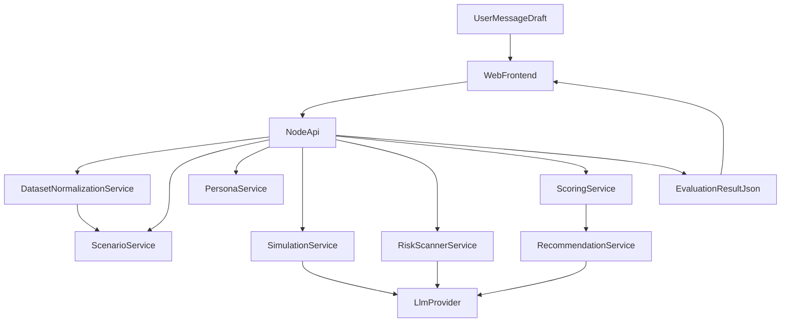

# Architecture

## Overview

AIEIO uses a lightweight architecture:

- Node.js backend for orchestration and scoring
- Static HTML/CSS/JavaScript frontend for interaction
- JSON files for authoritative datasets, generated scenarios/personas, and optional local persistence
- Containerized deployment for portability

## Modules

1. **Scenario Module**
   - Supports explicit dual-mode scenario creation:
     - Dataset-generated scenarios from `CORSAIR` and `GlobalMaritime`
     - Instructor custom scenarios
   - Builds metadata-rich scenario list from normalized source records
2. **Dataset Ingestion/Normalization Module**
   - Reads records from `data/CORSAIR` and `data/GlobalMaritime`
   - Normalizes incident metadata into a common scenario-source format
   - Preserves provenance fields for downstream explainability
3. **Persona Module**
   - Maps scenario to audience groups
   - Generates or retrieves synthetic persona profiles
4. **Simulation Module**
   - Runs persona response prompts against message input
5. **Risk Scanner**
   - Detects OPSEC, escalation, ambiguity, misinformation, and policy concerns
6. **Scoring & Explainability Engine**
   - Calculates trust and risk metrics
   - Produces rationale text tied to evidence
7. **Recommendation Module**
   - Suggests revised message wording
8. **API Layer**
   - Exposes endpoints for frontend and future integrations

## Data Flow



## Suggested Repository Layout

```text
/README.md
/docs/
/data/CORSAIR/
/data/GlobalMaritime/
/data/scenarios/
/data/personas/
/backend/
/frontend/
```

## Integration Readiness

- Keep stable JSON schemas and versioned endpoint contracts.
- Isolate provider-specific model logic behind a single service adapter.
- Avoid coupling UI rendering to raw model output.
- Preserve source provenance metadata end-to-end for dataset-generated scenarios.

## Security and Safety Notes

- Never expose API keys to frontend.
- Sanitize user input before model submission.
- Log risk classifications for transparency and after-action review.
